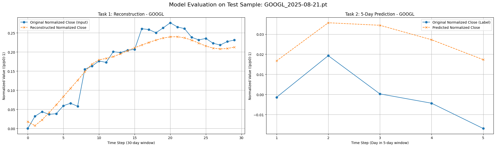
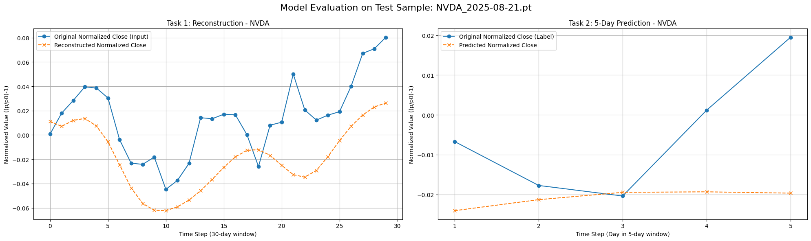
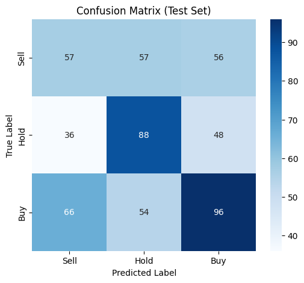
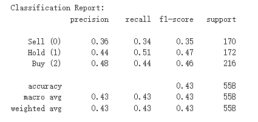
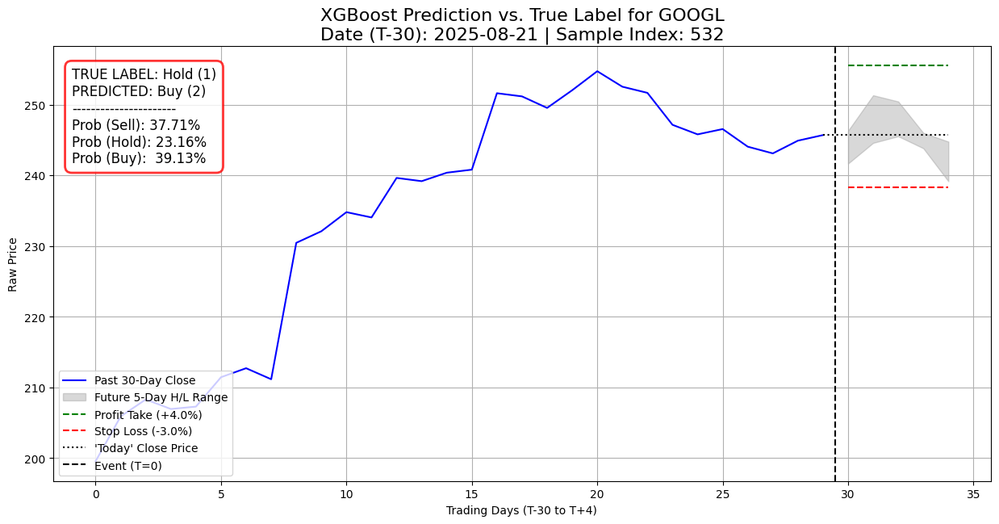
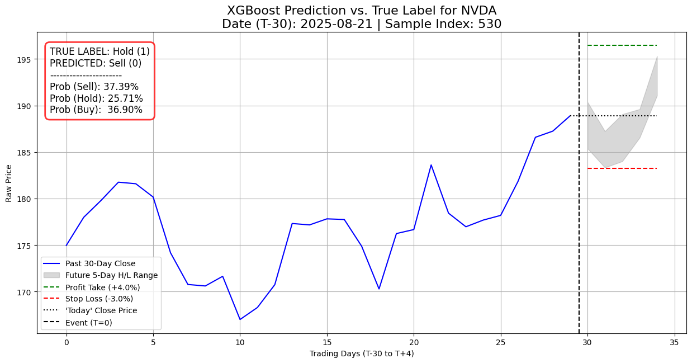
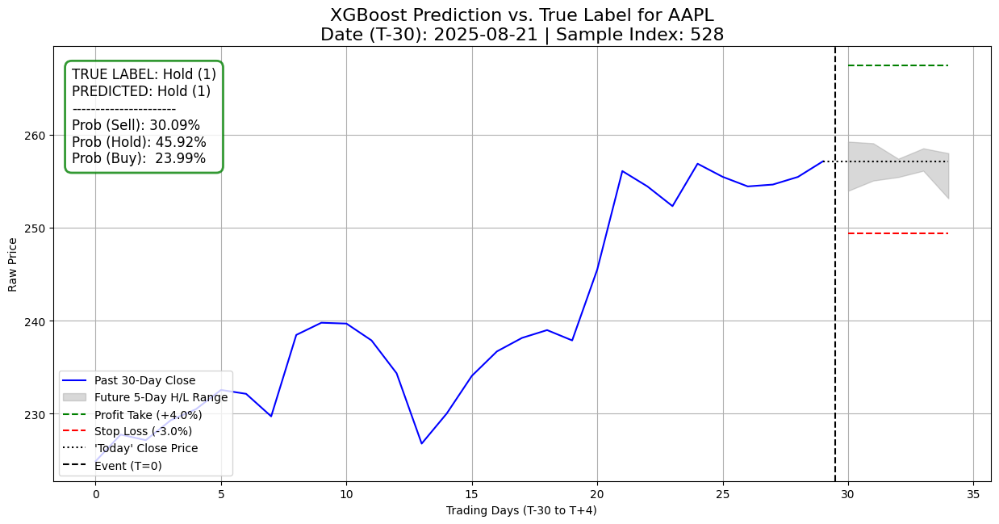
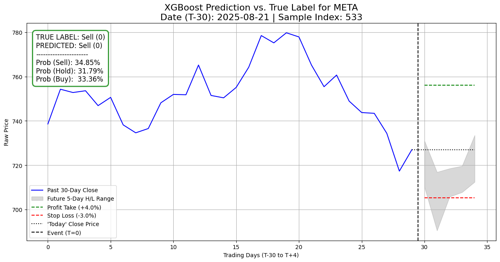

# Hybrid Financial Time-Series Forecasting Pipeline

**Project Overview**

This project represents my attempt to build a ML financial forecasting system from the ground up. It is a hybrid pipeline that combines a feature-extracting deep learning encoder with the decision-making of Gradient Boosting. I developed this primarily as a **portfolio study** to challenge myself with the "full-stack" AI lifecycle.

The objective here wasn't to implement off-the-shelf SOTA financial models, but rather to exercise self-directed learning and system design. Because of this, the scope is intentionally academic. I stuck to daily technical data (OHLCV) and derived indicators, ignoring fundamental analysis, sentiment data, or high-frequency execution engines. The scope is limited to forecasting only **short-term stock price movements for 30** major US large-cap assets. The focus is purely on constructing a custom hybrid architecture from first principles.

**Model Design**

The core architecture is a two-stage system designed to handle raw time-series data with engineered features. I constructed a custom Time-Series Encoder in PyTorch that incorporates multi-scale temporal context: it uses a 100-day global window to initialize the network with long-term trend awareness before processing the recent 30-day price history. This local channel is further enhanced by a parallel macro channel (QQQ), using Cross-Attention to weigh market trends against asset-specific movements.

To ensure this encoder could generalize across 30 different stocks, each stock is assigned a learned unique embedding vector which modulates the network via a Feature-wise Linear Modulation (FiLM) layer. Crucially, I implemented a two-stage, multi-task training process—pre-training the encoder for reconstruction before fine-tuning it on a combined prediction-reconstruction objective. Through this I intended to force the model to learn robust latent representations of market dynamics rather than overfitting to noise.

The output of this encoder is a dense vector representing the compressed 30-day history, which is then fed into an XGBoost classifier along with additional statistical features. Rather than optimizing for simple next-day price regression, the model is trained using the Triple Barrier Method to simulates a realistic trade execution by categorizing outcomes based on three potential future events: hitting a profit target, triggering a stop-loss, or reaching a time limit without significant movement. This transforms the problem into a classification task: distinguishing between Buy, Sell, and Hold signals.  

**Results**

Encoder Pre-training:

Below are sample outputs from the encoder's proxy decoder, showing both the reconstruction of the input sequence and the prediction of the future window. Note: The date displayed corresponds to T-30 (the start of the local 30-day input window).

The final classification performance from the XGBoost is evaluated against the Triple Barrier ground truth. Below are the accuracy metrics and confusion matrix on the test set.

Visualizations of sample predictions on test samples, with the historical window, the future price path (with Triple Barrier targets), and the model's predicted probabilities. 

**File descriptions**

The pipeline is implemented across four sequential Jupyter notebooks:

Data_pipeline.ipynb

Sampling.ipynb

Encoder_training_framework.ipynb

XGBoost_training_framework.ipynb

Individual file description can be found in the corresponding file.
